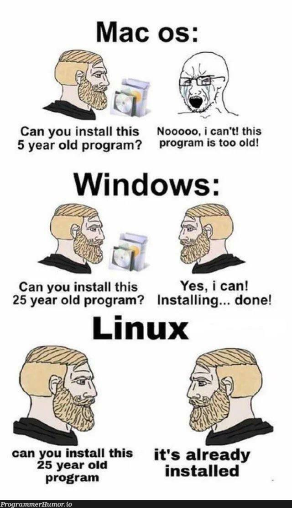
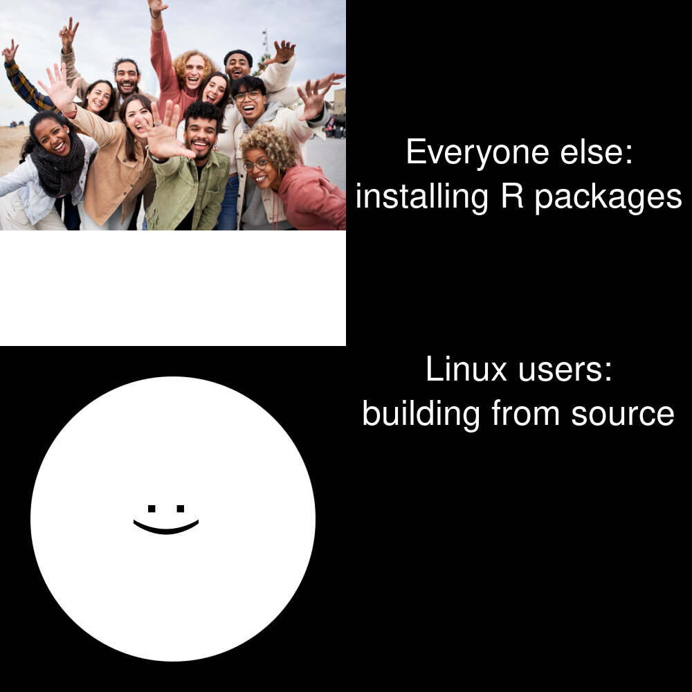
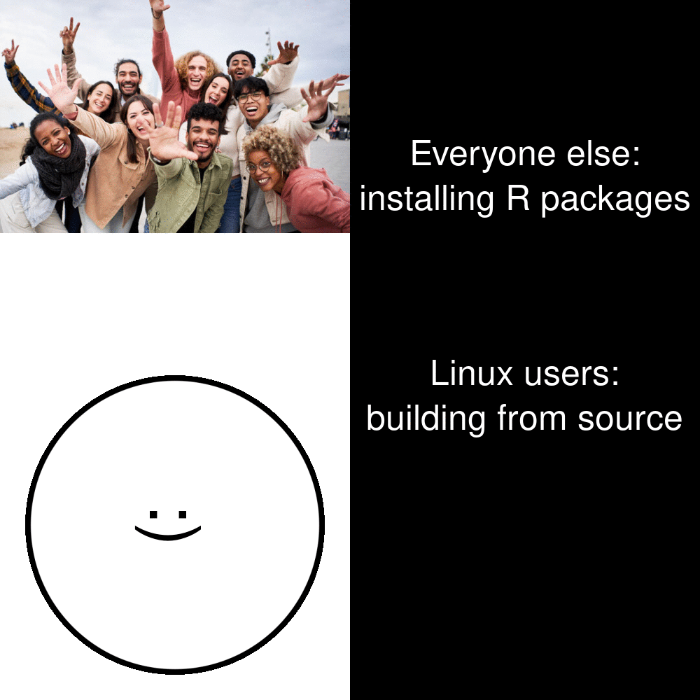

```{r setup, include=FALSE}
  knitr::opts_chunk$set(echo=TRUE, message=FALSE, warning=FALSE, error=FALSE)
```

```{css}
body {
  font-family: "Times New Roman", Times, serif;
}
h1 {
  color: turquoise
}

h2 {
  color: lightblue
}

h3 {
  color: navy
}

h4{
  color: orange
}
```

## Project requirements
I have created new public repository on GitHub called STATS220, where I will store codes and files for projects this semester. I have successfully pushed my meme, GIF, R code, inspiration meme and report onto it. In my README.md file I have used ordered and unordered bullet points to list off (ordered)my projects and (unordered)goals of the repository, 2 different level headers for the headings about and R project, bold and italics to highlight key words “University of Auckland” and “STATS220” and additionally links to the websites of the libraries I have used including a link to a page that explains what STATS220 is as a course. [Link to my STATS220 repository.](https://github.com/wzxiao1/stats220)
Screen Shot of folder:

.
## My meme

#### Inspiration meme:

.

### Key Component Changed:
From 3 “stacks” to 2 stacks merging MacOs users and Windows users to one and additionally changed the image associated to both panels with an image of happy people and also a image I created myself and animated into a GIF and depicts my experiences with R.
```{r meme-code, eval=TRUE}
# libraries
library(tidyverse)
library(magick)
#image variables image read + urls
explosion_url = "https://static.vecteezy.com/system/resources/previews/027/292/456/original/bomb-explosion-with-fire-flames-and-smoke-isolated-on-transparent-background-png.png"
explosion_image = image_read(explosion_url)
emotions = c(":)", ":|", ":/", ":(", "x(") # making emotions on face as vector
circle_url = "https://upload.wikimedia.org/wikipedia/commons/thumb/a/a0/Circle_-_black_simple.svg/800px-Circle_-_black_simple.svg.png"
happy_people_url = "https://t3.ftcdn.net/jpg/04/84/87/34/360_F_484873483_hg1ofIdXbMha5lKEDG3hJBrwKh1oikTq.jpg"
happy_people = image_read(happy_people_url) %>% image_scale(500)

# creation of my own images
face_image = image_read(circle_url) %>% #makes face
  image_scale(500)
meme_text_linux = image_blank(height = 500,  #makes lower text
                        width = 500,
                        color = "black") %>%
            image_annotate(font = "comic sans", gravity = "North", color = "white", text = "Linux users:\nbuilding from source", size = 50)
meme_text_windows = image_blank(width = 500, # makes upper text
                                height = 500,
                                color = "black") %>%
  image_annotate(font = "comic sans", gravity = "center", color = "white", text = "Everyone else:\ninstalling R packages", size = 50)

# creation of meme
first_row = c(happy_people, meme_text_windows) %>% 
  image_append() # appending happy people + text to make upper row
frame1 = face_image %>%  # choosing the initial facial emotion
  image_annotate(text=emotions[1], size = 100, gravity="center", degrees = 90) %>% 
  image_scale(500) %>%
  image_extent("500x500")
second_row = c(frame1, meme_text_linux) %>% # putting the face and the bottom text together
  image_append()
meme = c(first_row, second_row) %>% # putting top and bottom row together vertically stacking
  image_append(stack = TRUE)


```

#### Meme I made:

.

```{r animation-code, eval=FALSE}
# created the frames of the happy face -> explosion 6 frames total
frame1 = face_image %>% 
  image_annotate(text=emotions[1], size = 100, gravity="center", degrees = 90) %>% 
  image_scale(500) %>%
  image_extent("500x500")

frame2 = face_image %>% 
  image_annotate(text=emotions[2], size = 100, gravity="center", degrees = 90) %>% 
  image_scale(400) %>%
  image_extent("500x500")

frame3 = face_image %>% 
  image_annotate(text=emotions[3], size = 100, gravity="center", degrees = 90) %>% 
  image_scale(300) %>%
  image_extent("500x500")

frame4 = face_image %>% 
  image_annotate(text=emotions[4], size = 100, gravity="center", degrees = 90) %>% 
  image_scale(200) %>%
  image_extent("500x500")

frame5 = face_image %>% 
  image_annotate(text=emotions[5], size = 100, gravity="center", degrees = 90) %>% 
  image_scale(100) %>%
  image_extent("500x500")

frame6 = explosion_image %>%
  image_scale(500) %>%
  image_extent("500x500")

# making the different rows requiring for the GIF
# combining the different frames of the gif with its horizontal text
first_row = c(happy_people, meme_text_windows) %>% 
  image_append()
second_row = c(frame1, meme_text_linux) %>% 
  image_append()
second_row2 = c(frame2, meme_text_linux) %>% 
  image_append()
second_row3 = c(frame3, meme_text_linux) %>% 
  image_append()
second_row4 = c(frame4, meme_text_linux) %>% 
  image_append()
second_row5 = c(frame5, meme_text_linux) %>% 
  image_append()
second_row6 = c(frame6, meme_text_linux) %>% 
  image_append()

# creation of the different frames of the meme
# vertically stacking the upper and and different lower rows created above
meme = c(first_row, second_row) %>%
  image_append(stack = TRUE)
meme2 = c(first_row, second_row2) %>%
  image_append(stack = TRUE)
meme3 = c(first_row, second_row3) %>%
  image_append(stack = TRUE)
meme4 = c(first_row, second_row4) %>%
  image_append(stack = TRUE)
meme5 = c(first_row, second_row5) %>%
  image_append(stack = TRUE)
meme6 = c(first_row, second_row6) %>%
  image_append(stack = TRUE)

# making frames for animation
frames = c(meme, meme2, meme3, meme4, meme5, meme6)
animation = frames %>%
  image_animate()
# the animation
animation

my_animation = animation %>%
  image_write('my_animation.gif') # saved as GIF

```
#### My animation:

.

## Creativity

I believe I have demonstrated quite a bit of creativity. I have looked at the essence of a typical Linux vs popular OS meme and created one my own based on personal experiences dealing with R Studio and installing packages. Where I put a spin on the meme of usually Linux being more convenient (so it would seem) and can do more then the other operating systems. I changed both of the pictures and created my own GIF which required me to use a vector to store the emotions and also change the degree of rotation on the image to show my emotional state.  

## Learning reflection

### What I learned

- In module 1 I have learned how to manipulate images using image_annotate, image_blank, image_scale and other functions and also combining elements into a vector and appending vectors together to either create stacked images or horizontally extended images.

- I have also learned Markdown where I learned how to create links and showing images, use of bullet points both ordered and unordered and use of bold and italics and different size headers.

- I also learned much about Git and Github, creating a repository, using the command line to check Git Status, Git add, Git commit and Git push and the different branches

- I learnt about CSS styling for fonts and headers

### What I want to learn

- I would like to know if I am able to use some functions or methods to directly combine my gif with the bottom text instead of having to create several frames of the bottom vector and then combining it several times which seems inefficient to me

- More of CSS so I can design more visually appealing pages
